<p align="center">
  
</p>

# Hormuz Dock

A lightweight web app to manage multiple **Docker Compose** projects on a single server.
Drop in a git link, Hormuz Dock clones it, finds the compose file, and gives you a GUI to
edit env vars, start/stop the stack, and watch resource usage.

## Features

1. **Create project** — paste a Bitbucket / GitHub / any git URL (optional branch).
2. **Auto clone + detect** — the repo is cloned and must contain a `docker-compose.yml`
   (`.yaml` / `compose.yml` / `compose.yaml` are also accepted). Missing → rejected & rolled back.
3. **Env editor** — edit the project's `.env` from the web UI (form view or raw text).
   Compose reads it automatically on the next start/restart.
4. **Resource monitoring** — live CPU % and memory per container (and totals),
   auto-refreshed every few seconds via `docker stats`.
5. **Lifecycle control** — Start (`compose up -d`), Stop (`compose stop`),
   Restart, Pull (`git pull`), Logs, and Delete (`compose down` + remove repo).

## Requirements

- Node.js ≥ 18
- `git` on PATH
- Docker Engine + Docker Compose v2 (`docker compose`)

## Run

```bash
cd apphub
npm install
npm start           # or: npm run dev  (auto-reload)
```

Open http://localhost:4100

Change the port with `PORT=8080 npm start`.

## Run in Docker

Hormuz Dock can run in a container, but because it manages the **host's** Docker,
the setup is deliberate — a plain `docker run` will misbehave. A `Dockerfile` and
`docker-compose.yml` are included:

```bash
mkdir -p /opt/hormuz-dock/data
ADMIN_PASSWORD=your-strong-pass docker compose up -d --build
```

Three things in `docker-compose.yml` are required and why:

1. **Docker socket** (`/var/run/docker.sock`) — how it drives the host daemon
   (start/stop/build/stats/exec). This grants **root-equivalent control of the
   host** to anything that can reach the app. Treat it accordingly.
2. **Same-path data bind mount** — the data dir is mounted at an *identical
   absolute path* inside and out (`/opt/hormuz-dock/data`), and `DATA_DIR` points
   at it. The host daemon resolves cloned repos' **build contexts** and
   **`./relative` bind mounts** on the host filesystem, so the path Hormuz Dock
   clones into must exist at the same path on the host. (Verified: a project with
   a `./html` bind mount serves correctly through the containerized instance.)
3. **`network_mode: host`** — so the reverse proxy can reach managed apps on
   `127.0.0.1:<published-port>` and the app's own port binds on the host. Host
   networking is **Linux-only**; on Docker Desktop (mac/Windows) use a bridge
   network with `extra_hosts: ["host.docker.internal:host-gateway"]` and expect
   the `/_name` reverse proxy to need `host.docker.internal` instead of loopback.

Other notes:

- **Node ≥ 24** in the image (the built-in `node:sqlite` module is used unflagged).
- **Private git repos**: uncomment the `~/.ssh` mount for SSH remotes, or use an
  HTTPS URL with a token.
- The container runs as **root**, so files it writes to the data volume are
  root-owned on the host.

## How it works

- **No database** — project metadata is stored in `data/db.json` (atomic writes).
- **Cloned repos** live in `data/repos/<slug>/`.
- Each project runs under a pinned compose project name (`-p <slug>`), so its
  containers are consistently labeled and isolated from others.
- All shell calls use argument arrays (no shell interpolation) so git URLs and
  names can't inject commands. Git credential prompts are disabled so bad/private
  URLs fail fast instead of hanging.

## API

| Method | Path | Purpose |
|--------|------|---------|
| GET | `/api/system` | Host Docker info (CPUs, RAM, versions) |
| GET | `/api/projects` | List projects with live status |
| POST | `/api/projects` | `{name, gitUrl, branch?}` → clone & add |
| GET | `/api/projects/:id` | Project + container detail |
| DELETE | `/api/projects/:id` | compose down + remove |
| POST | `/api/projects/:id/start\|stop\|restart` | Lifecycle |
| POST | `/api/projects/:id/pull` | git pull |
| GET | `/api/projects/:id/stats` | CPU/mem per container |
| GET | `/api/projects/:id/logs?service=&tail=` | Recent logs |
| GET/PUT | `/api/projects/:id/env` | Read / write `.env` |

## Security note

Hormuz Dock has username/password auth with **admin** and **user** roles, cookie
sessions, and an audit log. But it also runs Docker and git on the host and offers
a **web shell into containers** — so any authenticated account is effectively
**root-equivalent on the host** (doubly so when run with the Docker socket
mounted). Therefore:

- Change the seeded `admin` password immediately (or set `ADMIN_PASSWORD` before
  first run) and only hand out accounts to people you'd trust with host root.
- There is **no HTTPS** built in — put it behind a TLS-terminating reverse proxy,
  or bind to localhost and reach it via SSH tunnel. Run it on a trusted network.
- The reverse-proxy `/_name` routes are intentionally **public** (they serve your
  published apps); don't expose anything sensitive that way.
